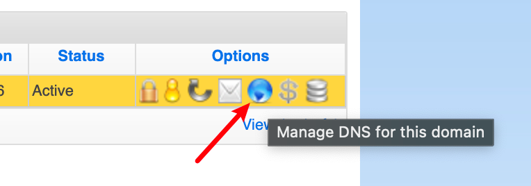
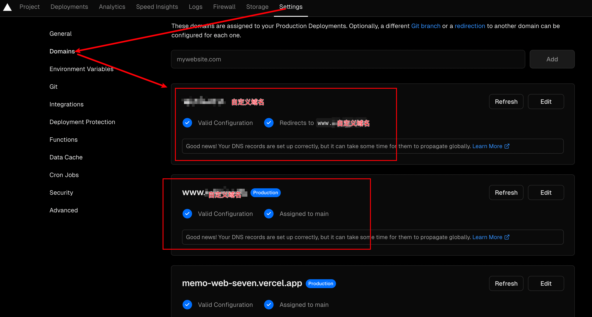

## UI
### 定义组件
1. 导出组件 - export default 前缀
2. 定义函数 - 组件名字必须以大写字母开头
3. 添加标签
``` js
//Congratulations.js
export default function Congratulations() {
  return (
    <h1>干得漂亮！</h1>
  );
}
```

### 导入&导出组件
| 语法  |                 导出                  |               导入                 |
| ---- | ------------------------------------- | --------------------------------- |
| 默认  | `export default function Button() {}`  |  `import Button from './Button.js'`  |
| 具名  | `export function Button() {}`         |  `import {Button} from './Button.js'` |


### JSX
JSX 是 JS 语法扩展
#### JSX规则
1. 只能返回一个根元素，可以用 <> 和 </> 元素来代替，这个空标签被称作 [Fragment](https://zh-hans.react.dev/reference/react/Fragment)，在底层其实被转化为JS对象，所以 JSX 标签需要被一个父元素包裹。
2. 标签必须闭合
3. 使用驼峰式命名法给大部分属性命名 ！React DOM元素中所有对应的[属性](https://zh-hans.react.dev/reference/react-dom/components/common)

#### JSX中通过大括号使用JS
1. 使用引号传递字符串
2. {}内引用 JS 变量
3. {}内调用 JS 函数
4. {}内使用 JS 对象

### 组件通信（🉑️传递任何JS值包括对象、数组、函数
1. 将props传递给子组件 
2. 在子组件中读取props
```js
export default function Profile() {
  return (
    <Avatar
      person={{ name: 'Lin Lanying', imageId: '1bX5QH6' }}
      size={100}
    />
  );
}
// props 可以指定给一个默认值
function Avatar({ person, size = 100 }) {
  // 在这里 person 和 size 是可访问的
}
```

### 渲染UI（条件渲染/渲染列表）
1. 根据不同条件使用 三目运算符（?:）/与运算符(&&) 返回不同JSX，渲染
2. 通过JS的 map()/filter() 方法 渲染
```js
const listItems = chemists.map(person =>
  <li>...</li> // 隐式地返回 可省略return语句
);
const listItems = chemists.map(person => { 
  // 花括号必须使用return 指定返回值
  return <li>...</li>;
});
```


## 交互
1. 添加事件处理函数 传递/读取props
```js
function Button({ onSmash, children }) {
  return (
    // ✅ 正确：将事件处理函数传递下去
    <button onClick={onSmash}> {children} </button>
    // ✅ 正确：传递一个内联函数
    // <button onClick={(e) => handleClick(e)}>Click me</button>
    // <button onClick={function handleClick(){ alert('你点击了我！');}}>点我</button>
    // <button onClick={() => { alert('你点击了我！');}}>点我</button>
  );
}

export default function App() {
  return (
    <div>
      <Button onSmash={() => alert('正在播放！')}>
        播放电影
      </Button>
      <Button onSmash={() => alert('正在上传！')}>
        上传图片
      </Button>
    </div>
  );
}
```

#### 事件传播 
|             行为          |                 方法            |         描述          |
|:------------------------:|:-------------------------------:|----------------------------|
|阻止传播                    |`e.stopPropagation()`       | 阻止触发绑定在外层标签上的事件处理函数 |
|阻止默认行为                |`e.preventDefault()`            | 阻止少数事件的默认浏览器行为。|


## 常用 Hooks
### useState 状态变量
```js
// 1 为组件添加状态
// 2 根据先前的 state 更新 state
const [thing, setThing] = useState(initialState)
// 3 更新状态中的对象和数组(避免使用会改变原始数组) 
// 可以使用 ... 对象展开 语法
  setForm({
    ...form,
    firstName: 'Taylor'
  });
  // 可以在对象的定义中使用 [ 和 ] 括号来实现属性的动态命名
  setPerson({
    ...person,
    [e.target.name]: e.target.value
  });
  // 添加元素 concat [...arr]
  setCategory([
    newCategory,
    ...category
  ])
  // 向数组中插入元素
  function handleClick() {
    const insertAt = 1; // 可能是任何索引
    const nextArtists = [
      // 插入点之前的元素：
      ...artists.slice(0, insertAt),
      // 新的元素：
      { id: nextId++, name: name },
      // 插入点之后的元素：
      ...artists.slice(insertAt)
    ];
    setArtists(nextArtists);
    setName('');
  }
  // 删除元素 filter slice
  setCategory(category.filter(lists => lists.id !== items.id)) 
  // 替换元素 map
  function handleIncrementClick(index) {
    const nextCounters = counters.map((c, i) => {
      if (i === index) {
        // 递增被点击的计数器数值
        return c + 1;
      } else {
        // 其余部分不发生变化
        return c;
      }
    });
    setCounters(nextCounters);
  }
  // 排序 先将数组复制一份 sort reverse
  function handleClick() {
    const nextList = [...list];
    nextList.reverse();
    setList(nextList);
  }
/*
4 避免重复创建初始状态
5 使用 key 重置状态
6 存储前一次渲染的信息，在相同位置渲染的是相同组件， React 就会保留状态
7 状态提升: state 移动到共同的父组件中，用props传递信息。要考虑组件是“受控”（由 prop 驱动）或是“不受控”（由 state 驱动）
*/
```
### useRef 引用值

#### useRef与state 的区别
| 特性             | useRef                           | useState                     |
|-----------------|----------------------------------|------------------------------|
| 返回值           | `{ current: initialValue }`       | `([变量的当前值, 设置函数])` |
| 触发重新渲染     | 更改时不会触发重新渲染          | 更改时触发重新渲染           |
| 可变性           | 可变 -- 你可以在渲染过程之外修改和更新 `current` 的值 | 不可变 -- 必须使用 state 设置函数来修改 state 变量，从而排队重新渲染 |
| 渲染期间使用     | 你不应在渲染期间读取（或写入）`current` 值 | 你可以随时读取 state。但是，每次渲染都有自己不变的 state 快照 |
| 使用场景         | 1. 组件需要存储一些值，但不影响渲染逻辑 |存储需要触发组件更新和重新渲染的数据｜
|                 | 2. 常用于访问 DOM 元素 |
|                 | a. 存储 timeout ID |
|                 | b. 存储和操作 DOM 元素，例如聚焦、滚动或测量 DOM 元素 |
|                 | c. 存储不需要用来计算 JSX 的其他对象 |
```js
import { forwardRef, useRef } from 'react';
// 默认情况下，组件不暴露其 DOM 节点。 您可以通过使用 forwardRef 并将第二个 ref 参数传递给特定节点来暴露 DOM 节点
const MyInput = forwardRef((props, ref) => {
  return <input {...props} ref={ref} />;
});
export default function Form() {
  const inputRef = useRef(null);

  function handleClick() {
    inputRef.current.focus();
  }
  return (
    <>
      <MyInput ref={inputRef} />
      <button onClick={handleClick}>
        聚焦输入框
      </button>
    </>
  );
}
```
### useEffect 副作用
👉[入门](https://www.ruanyifeng.com/blog/2020/09/react-hooks-useeffect-tutorial.html)
👉[必看文章](https://overreacted.io/zh-hans/a-complete-guide-to-useeffect/)
useEffect 允许你将组件与外部系统同步。
Effect 在 React 中是专有定义——由渲染引起的副作用。为了指代更广泛的编程概念，也可以将其称为“副作用（side effect）”。
Effect 通常用于暂时“跳出” React 代码并与一些 外部 系统进行同步。这包括浏览器 API、第三方小部件，以及网络等等。如果你想用 Effect 仅根据其他状态调整某些状态,👉[如](https://zh-hans.react.dev/reference/react/useEffect#examples-connecting)。
1. 编写
```js
// 1. 声明Effect 
import { useEffect } from 'react';
function MyComponent() {
  useEffect(() => {
    // 2. 指定Effect依赖
    // useEffect(() => { // 这里的代码会在每次渲染后执行 });
    // useEffect(() => { // 这里的代码只会在组件挂载后执行 }, []);
    // useEffect(() => { //这里的代码只会在每次渲染后，并且 a 或 b 的值与上次渲染不一致时执行 }, [a, b]);
    // 3. 按需添加清理函数
    // 下次 Effect 运行之前以及卸载期间这两个时候调用清理函数
    // 重新挂载而中断，那么需要实现一个清理函数
  });
  return <div />;
}
```
2. Effect 的生命周期 
a. 当组件被添加到屏幕上时，它会进行组件的 挂载。
b. 当组件接收到新的 props 或 state 时，通常是作为对交互的响应，它会进行组件的 更新。
c. 当组件从屏幕上移除时，它会进行组件的 卸载。

3. 处理开发环境中Effect执行两次的方法
```js
// 控制非react组件
useEffect(() => {
  const dialog = dialogRef.current;
  dialog.showModal();
  return () => dialog.close();
}, []);

// 订阅事件
useEffect(() => {
  function handleScroll(e) {
    console.log(window.scrollX, window.scrollY);
  }
  window.addEventListener('scroll', handleScroll);
  return () => window.removeEventListener('scroll', handleScroll);
}, []);

// 触发动画
useEffect(() => {
  const node = ref.current;
  node.style.opacity = 1; // 触发动画
  return () => {
    node.style.opacity = 0; // 重置为初始值
  };
}, []);

// 获取数据 考虑使用或构建客户端缓存。目前受欢迎的开源解决方案是 React Query、useSWR 和 React Router v6.4+。
// 清理函数应该要么 中止该数据获取操作，要么忽略其结果：
useEffect(() => {
  let ignore = false;
  async function startFetching() {
    const json = await fetchTodos(userId);
    if (!ignore) {
      setTodos(json);
    }
  }
  startFetching();
  return () => {
    ignore = true;
  };
}, [userId]);
// 最好的方法是使用一种可以删除重复请求、并缓存请求响应的解决方案：
function TodoList() {
  const todos = useSomeDataLibrary(`/api/user/${userId}/todos`);
  // ...
}

// 发送分析报告
function Page({ url, shoppingCart }) {
  const onVisit = useEffectEvent(visitedUrl => {
    logVisit(visitedUrl, shoppingCart.length)
  });

  useEffect(() => {
    onVisit(url);// 发送 POST 请求
  }, [url]); // ✅ 所有声明的依赖项
  // ...
}
// 初始化应用时不需要使用Effect的情形
// 不要再Effect中执行购买商品一类的操作
// 如果 Effect 一定要阻止浏览器绘制屏幕，使用 useLayoutEffect 替换 useEffect。请注意，绝大多数的 Effect 都不需要这样。只有当在浏览器绘制之前运行 Effect 非常重要的时候才需要如此：例如，在用户看到 tooltip 之前测量并定位它。
```
### useCallback
允许多次渲染中缓存函数,常用于性能优化
1. 跳过组件的重新渲染
2. 从记忆化回调中更新state
3. 防止频繁触发Effect
4. 优化自定义Hook
```js
const cachedFn = useCallback(fn, dependencies)//(任何参数并且返回任何值要缓存的函数,有关是否更新 fn 的所有响应式值的一个列表)
```
### useMemo 记忆化
它在每次重新渲染的时候能够缓存计算的结果
1. 跳过代价昂贵的重新计算
2. 跳过组件的重新渲染
3. 记忆另一个Hook的依赖
4. 记忆一个函数
```js
const cachedValue = useMemo(calculateValue, dependencies)//(返回任意类型要缓存计算值的函数,使用的响应式变量组成的数组)
```

## 如何实现国内访问vercel部署的项目
[参考](https://blog.csdn.net/qq_62352333/article/details/134583242)
### 在[namesilo](https://www.namesilo.com/)购买域名（可以支付宝付款）
配置步骤：
1. 找到域名管理入口👇
  
2. 选择新域名项找到该图标点击进入,需要删除默认的记录👇
  
  
3. 选择新域名项，修改 Nameservers ，原本的删除，把在 Cloudflare 配置好的名称服务器粘贴上去👇
  
  
  

### 使用[Cloudflare](https://www.cloudflare.com)托管
配置步骤：
1. 控制台添加新域名的配置，拉到最底部使用免费计划，如果新域名有扫描到DNS记录，需要全部删除掉（新域名的DNS配置也需要删除）
  
2. 把 Vercel 这两个项的内容粘贴到 Cloudflare 添加DNS配置👇
  
  
3. 解决重定向次数过多👇
  

### [Vercel](https://vercel.com/)自定义域名
配置步骤：
1. 添加自定义域名
  
  